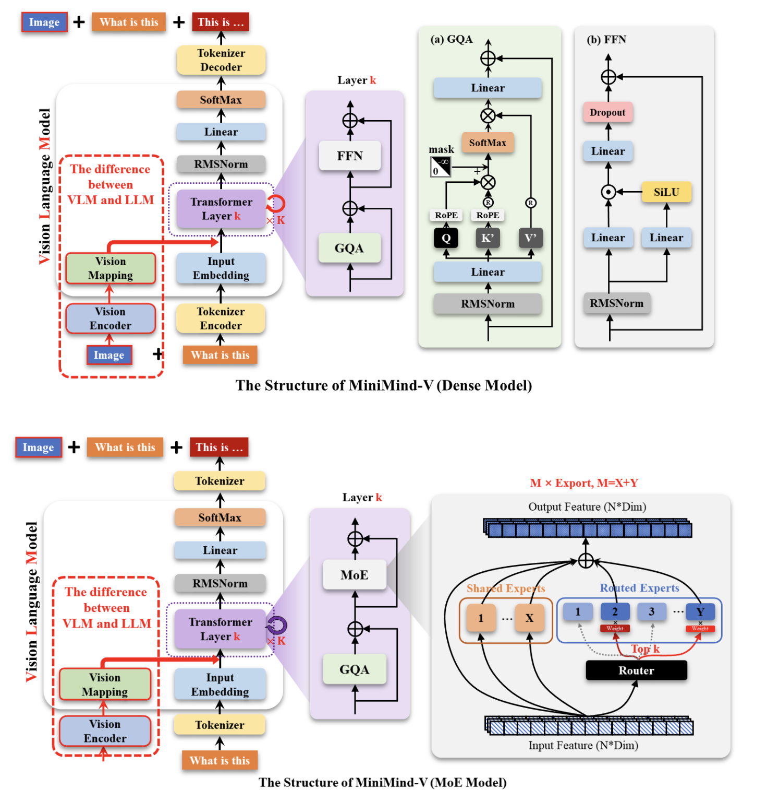

### 1.训练流程概述

> 以上是minimind-v的结构框架与实现流程，在本次训练中将MoE=false进行训练，所以训练了个Dense model。
> 在训练llm中，主要训练部分是在k layers transformer 而在本次vision model训练中，要基于一个llm底座进行训练，训练主流分为两个部分：
> - projector训练，也就是上图的在 vision encoder 到 vision mapping 这里的projector中 MLP(?) 结构采取先升维再降维的想法，那么第一阶段，就是在调projector里的参数了，而vision encoder和transformer都是froze的，这里可以理解成pretrain vlm
> - projector+llm联调，第二阶段，为了使模型对于图片语义理解更准确，会同时projector&&llm 解冻，这里可以理解成sft
> - 在本次训练中，基于minimind-v的官方源码+数据集进行小参数复现，这里采用官方方法将两阶段合一同时进行了pretrain&sft 具体技术方案是通过unfroze transformer的首末两层+projecotr然后共同训练

### 2.数据&&源码准备
> 通过在huggingface上下载来自minimind-v的官方dataset(~4.7G)，找融合了pretrain和sft的dataset
> 在github上git clone minimind源码到本地
> 获取GTC-2.5 Preview 的参数文件
> 拼接以上内容至正确文件目录下(dataset要放在dataset目录下，参数文件放在out目录下)

### 3.远程连接服务器&&上传文件
>通过在funhpc云端平台上传文件，学习ssh相关用法，接下来通过QA形式描述下经历的问题和解决办法还有学到的东西
>租用了服务器以后，如何通过ssh远程连接呢？
>	连接过程中 按照ds给的本地终端ssh建议，发现 password 输入以后进不去，回permission denied，发现本地终端输入密码连接远程ssh不可行
>	借助来自Frontier的帮助，我采用vscode remote ssh插件，然后操作方法是以下：
>	1.下载以后 `cmd+shift+p` 打开命令，主要命令有
>		- `Remote-SSH:Connect to host`
>		- `Remote-SSH:Open ssh configuration file`
>		- `Remote-SSH:Add new ssh host
>	以上，先通过ssh configuration file进行配置ssh，然后是直接connect to host（configuration file支持多个远程主机配置，手动维护并更新即可 connect to host里面选择）,结束以后输入云端平台给的密码即可
>	2.还有一种连接方式是云端给的web server更加方便一些，但通过cpu那个机上传是没有web server提供的 但本质都差不多，相当于提供云端机器终端
>	3.上传文件即可
>什么是挂载硬盘，云端数据该储存在哪里？
>	第一次上传文件可以通过cpu那个机子传，传完以后通过释放关机并保存数据即可，但第二次再想补充或开始训练时，通过在配置界面选择之前存的数据的名字那个就行

### 4.训练要点
>通过V100 32G训练GTC-2.5V Preview 获得对于GPU的直观认识和熟悉训练过程。
>先选择pytorch环境启动，开启tmux防断连，然后安装依赖
>问题：训练时文件路径不统一
>	要在训练开始前有一定文件结构认识，这里真的调了非常多的时间，下次在上传前就要在目录下的主程序调用中看清调用文件路径 再怎么看不懂代码这里一定是要理解结构的，要不然终端一直not found file
>	以后在终端输入训练命令的时候就可以设置好读取的文件路径
>问题：训练时怎么训 调哪些参数 对V100 32G认识哪些？
>   参数主要有`batch_size` 每次喂给GPU样本数 这个在48设置下只用了15/32G 显存 保守了 下次至少64起步 这也是排查oom的主要注意点
>   `epochs` 完整训练几轮
>   `learning rate`是学习率
>训练全程时间还是很长的，观察训练效果主要关注loss 注意到这次训练loss从2.7左右震荡下降，最后最低1.8887 总共训练时长我训了4h

### 5.训练结束
>结束之后，用于部署的主要应该是模型的权重.pth和eval.py那个运行的脚本

以上第一次直观感受模型训练的过程，跑通了工程上的流程，但对于代码还没有深刻了解，未来计划认真学习minimind各项目源码，争取暑假再写一篇混合代码、架构、底层原理的blog解析llm的实现。